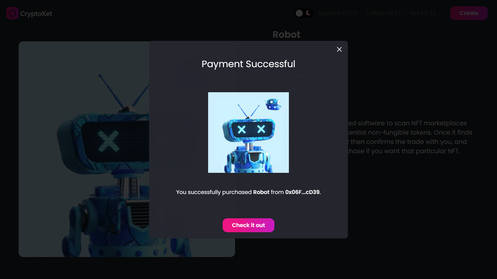

# CryptoKet 

CryptoKet is a NFT marketplace where users can mint their pictures as NFT, list their NFTs for sale, and as well buy NFTs from other user.

# ⚖ Problems Solved (SDG Relevant)

- It enables users to mint and sell their pictures as NFTs which generates income.

- It creates job opportunities.

- It helps to curb world poverty rate.

- It provides aesthetic appreciation.

- It enables people to learn and appreciate different cultures.

# 🛠 Technology Stack & Tools

- Solidity (Writing Smart Contract)
- Javascript (NextJs & Testing)
- Ether (Blockchain Interaction)
- hardhat (Development Framework)

# ⛓ Blockchain Protocol used

- ERC-721 standard

# ⚙ Requirements For Initial Setup
- Install NodeJS, should work with any node version below 16.5.0
- Install Hardhat, In your terminal, you can check to see if you have Hardhat by running Hardhat version. To install Hardhat `npm i hardhat`. Ideal to have hardhat version 5.4 to avoid dependency issues.

# 🚀 Quick Start

📄 Clone or fork NFT-Marketplace-CryptoKet:

```
https://github.com/paschal533/NFT-Marketplace-CryptoKet.git
```
💿 Install all dependencies:
 
```
$ cd NFT-Marketplace-CryptoKet
$ npm install 
```

# 🚴‍♂️ Run your App:

```
npm run dev
```

- Note :- This app was deploy to Rinkeby testnet, so you need to connect your wallet to Rinkeby before you can Interact with the app.

# 📽 Video demo link

- [Video link](https://drive.google.com/file/d/1OPlyqE7BVSyyOEMCVynuHGx-iB6TJzMC/view?usp=sharing) :- https://drive.google.com/file/d/1OPlyqE7BVSyyOEMCVynuHGx-iB6TJzMC/view?usp=sharing

# ✨ [Live preview](https://nft-marketplace-crypto-ket.vercel.app/) :- https://nft-marketplace-crypto-ket.vercel.app/

# 🎗 Overview

- Home page


- Listed NFTs page


- My NFTs page


- NFT details and purchase NFT page




- Create and Mint NFT page


- Light Mode


- [Live preview](https://nft-marketplace-crypto-ket.vercel.app/)

# this is my submission for the Africa Blockchain Center (ABC) web3 Hackathon
